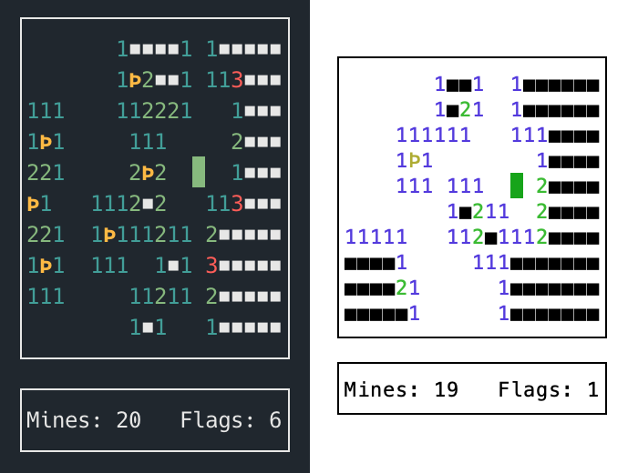

# terminal-mines
An [ncurses](https://en.wikipedia.org/wiki/Ncurses)-based minesweeper game. This was made because I wanted a minesweeper game that was efficient to play without mouse. It's also a reference frontend for [libminesweeper](https://github.com/accatyyc/libminesweeper/).

 

## Installation

### OSX Homebrew
```
brew install joelekstrom/repo/terminal-mines
```

### Other OS's/manual compilation
After cloning the project, `cd` to the folder and run:

```
git submodule update --init
make install
```

Terminal Mines is now installed on your system.

## Starting the game
Run the game by typing `terminal-mines`. Run `terminal-mines --help` or `man terminal-mines`
to view additional info.

To select size/difficulty, play with the following options:

- `--width` Width of the game board
- `--height` Height of the game board
- `--mine-density` a value between 0.0 and 1.0 where 1.0 means every tile will have a mine, and 0.0 means zero tiles will have mines.

All the arguments can be written shorthand with the first letter in the name.

Example:
```
terminal-mines -w 20 -h 20 -m 0.5
```

## Controls
- Movement: `hjkl` or arrow keys
- Place flag: `f` or `g`
- Open tile: `,`

The controls were inspired by nethack/vim.

## Adventure Mode

Adventure Mode is a new mode added in version 1.1.0. To start a game in adventure mode,
use the `--adventure-mode` or `-a` option. When playing in adventure mode, you control
the player character, `@`, and you must reach the exit tile, `>`.

Every tile you cross will be opened, and you can not place any flags. The standard
difficulty options work in adventure mode as well.

## Using plain ASCII
If you prefer the old graphics, compile with `make ascii-only`
before running `make install`.

## Uninstall
To completely remove terminal mines (if you compiled it yourself), run `make uninstall` in
the source folder.
